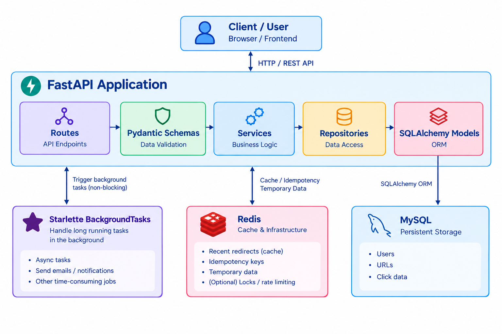

# URL Shortener

URL shortener is a project built with FastAPI, SQLAlchemy and Redis, with Celery used for background processing. Rather than simple CRUD operations, it involves various design features that makes the application to perform well even at scale. It Uses Twitter Snowflake style algorithm to generate unique IDs and Base62 encoding technique to genarate short codes uniquely.

## Features

- Create short URLs from long original URLs (Even without login)
- JWT-based authentication
- View and delete URLs belonging to authenticated user
- Track click counts and analytics of authenticated user
- Redirect users from a short code to the corresponding original URL quickly without waiting for click record insertion

## Tech Stack

- **Frontend**: HTML, CSS, Javascript
- **Backend**: FastAPI, JWT Authentication, Pydantic, SQLALchemy ORM, Redis
- **Database**: MySQL

## Architecture



## Backend Features

- **ID Generation** — Twitter Snowflake style algorithm that combines UNIX timestamp and sequence number. (Can include workerid for distributed servers)
- **ShortCode Generation** — Uses Base-62 Encoding technique to create short codes since it ensures uniqueness, keeps the length minimum and saves storage.
- **Data Validation** — Validates the incoming long urls to check if they are in proper format and follow standard HTTP & HTTPS protocols. 
- **Authentication** — Uses JWT authentication technique that securely stores the token in a HttpOnly cookie with a limited expiry time.
- **Database Integrity** — Ensures database integrity by adding unique constraint for (user_id, original_url) combination to ensure no duplicate urls are stored corresponding to a user, handling concurrency.
- **Idempotency** — Redis-based idempotency keys with TTL to prevent processing duplicate short url creation requests.
- **Caching** — Redis-based caching for fetching original url corresponding to a short url with minimum latency.
- **Background processing** — Handles background tasks like creating click records and incrementing count with FastAPI BackgroundTasks class. (Can move to celery for heavy processing)
- **Asynchronous task execution** — Executes the redirect requests asynchronously to avoid blocking the event loop.


## Setup

1. Create and activate your virtual environment.

```bash
python -m venv .venv
.venv\Scripts\activate
```

2. Install dependencies.

```bash
python -m pip install -r requirements.txt
```

3. Create and configure the variables in `.env` file as specified in .env.example.


4. Start the uvicorn ASGI server.

```bash
uvicorn myapp.main:app --reload
```

5. Make sure Redis is running locally on 127.0.0.1:6379 or create a live instance on a cloud platform like Upstash and specify its URL in .env

Verify the Redis connection:

```bash
   redis-cli ping  # Expected output: PONG
```

6. Open the UI at:

```text
http://127.0.0.1:8000/
```

## License

This project does not include a license file by default.
